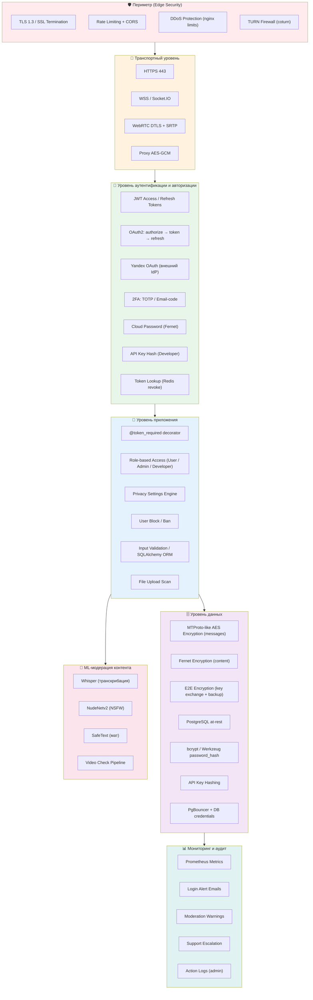

# Vondic — Mermaid-диаграммы архитектуры

> Вставь код из блоков `mermaid` в [https://mermaid.live](https://mermaid.live) или используй плагин Mermaid в VS Code / Obsidian / GitLab / GitHub.

---

## 1. Общая архитектура системы (клиент — сервер — БД — ИИ-микросервис)

```mermaid
graph TB
    subgraph Clients["🖥️ Клиенты"]
        direction TB
        Web["Web (Next.js)
        <small>frontend :3000</small>"]
        Desktop["Desktop (Electron)
        <small>desktop :3001</small>"]
        Mobile["Mobile (React Native)
        <small>App / iOS / Android</small>"]
        Extension["Browser Extension
        <small>Chrome/FF</small>"]
        BotClient["Telegram Bot
        <small>botiksdk</small>"]
    end

    subgraph Edge["🌐 Edge Layer"]
        Nginx["NGINX Reverse Proxy
        <small>HTTPS 443, SSL termination</small>"]
        StaticNginx["Static-Nginx
        <small>/uploads /static</small>"]
        Turn["TURN Server (coturn)
        <small>3478, 50000-50050</small>"]
    end

    subgraph Services["⚙️ Микросервисы"]
        direction TB
        Backend["Backend API
        <small>Flask + Gunicorn :5050</small>"]
        Webrtc["WebRTC Signaling
        <small>Flask-SocketIO :5000</small>"]
        VideoChecker["Video Checker
        <small>Whisper + NudeNetv2 + SafeText</small>"]
        VideoWorker["Video Worker
        <small>RabbitMQ consumer</small>"]
        ProxyReceiver["Proxy Receiver
        <small>AES-GCM TCP proxy</small>"]
        RagApi["Support RAG API
        <small>/ask</small>"]
        SupportApi["Support API
        <small>эскалация</small>"]
    end

    subgraph DataLayer["💾 Хранилища"]
        direction TB
        PgBouncer["PgBouncer
        <small>:6432</small>"]
        Postgres[("PostgreSQL 15
        <small>vondic :5432</small>")]
        Redis[("Redis
        <small>:6379</small>")]
        RabbitMQ[("RabbitMQ
        <small>:5672</small>")]
    end

    subgraph AIServices["🤖 ИИ / ML / Внешние API"]
        Ollama["Ollama LLM
        <small>llama3.1 — Vondic AI</small>"]
        YandexOAuth["Yandex OAuth
        <small>авторизация</small>"]
        Stripe["Stripe
        <small>платежи</small>"]
        SMTP["SMTP / Email
        <small>2FA, уведомления</small>"]
        Prometheus["Prometheus
        <small>метрики /metrics</small>"]
    end

    Clients -->|HTTPS/WSS| Nginx
    Nginx -->|/api /oauth| Backend
    Nginx -->|/socket.io| Webrtc
    Nginx -->|/uploads /static| StaticNginx
    Backend -->|HTTP POST| Webrtc
    Backend -->|AMQP publish| RabbitMQ
    RabbitMQ -->|consume| VideoWorker
    VideoWorker -->|subprocess| VideoChecker
    Backend -->|SQLAlchemy| PgBouncer
    Webrtc -->|asyncpg| PgBouncer
    PgBouncer --> Postgres
    Backend -->|cache / sessions| Redis
    Webrtc -->|presence| Redis
    Backend -->|HTTP| RagApi
    Backend -->|HTTP| SupportApi
    Backend -->|HTTP| Ollama
    Backend -->|HTTP| YandexOAuth
    Backend -->|SDK| Stripe
    Backend -->|Flask-Mail| SMTP
    Backend -->|metrics| Prometheus
    Webrtc -->|metrics| Prometheus
    Web -->|WebRTC| Turn
    Mobile -->|WebRTC| Turn
    Desktop -->|WebRTC| Turn

    style Clients fill:#e1f5fe
    style Edge fill:#fff3e0
    style Services fill:#e8f5e9
    style DataLayer fill:#fce4ec
    style AIServices fill:#f3e5f5
```



---

## 2. Вондик Backend API — общий вид

```mermaid
graph TB
    subgraph ClientLayer["Клиентский слой"]
        WebApp["Web / Desktop / Mobile"]
        ExtAPI["Внешние интеграторы"]
        TelegramBot["Telegram Bot"]
    end

    subgraph APIGateway["API Gateway / Edge"]
        Nginx["NGINX
SSL + CORS"]
        TokenCheck["token_required
JWT / Access Token"]
    end

    subgraph BackendAPI["Backend API :5050"]
        direction TB

        subgraph PublicAPI["Public API (без CORS)"]
            PubAccount["account"]
            PubBots["bots"]
            PubChat["chat"]
            PubUsers["users"]
            PubPosts["posts"]
            PubComments["comments"]
            PubMessages["messages"]
        end

        subgraph ProtectedAPI["Protected API v1"]
            AuthAPI["auth"]
            UsersAPI["users"]
            UsersExtAPI["users_extension"]
            ChannelsAPI["channels"]
            GroupsAPI["groups"]
            MessagesAPI["messages"]
            DmAPI["direct_messages"]
            PostsAPI["posts"]
            CommentsAPI["comments"]
            FriendsAPI["friends"]
            SubsAPI["subscriptions"]
            PaymentsAPI["payments"]
            GiftsAPI["gifts"]
            CommunitiesAPI["communities"]
            VideosAPI["videos"]
            PlaylistsAPI["playlists"]
            UploadAPI["upload"]
            SupportAPI["support"]
            E2EAPI["e2e_keys"]
            StorisAPI["storis"]
            SearchAPI["search"]
            FilesAPI["files"]
            BotsAPI["bots"]
        end

        subgraph OAuthServer["OAuth2 Server"]
            OAuthAuthorize["/authorize"]
            OAuthToken["/token"]
            OAuthRefresh["/refresh"]
            OAuthUserinfo["/userinfo"]
            OAuthClients["client mgmt"]
        end

        subgraph ServicesLayer["Services Layer"]
            AuthSvc["AuthService"]
            UserSvc["UserService"]
            MsgSvc["MessageService"]
            PostSvc["PostService"]
            ChanSvc["ChannelService"]
            GrpSvc["GroupService"]
            CommSvc["CommunityService"]
            BotSvc["BotService"]
            SubSvc["SubscriptionService"]
            EmailSvc["EmailService"]
            OllamaSvc["OllamaService"]
            E2ESvc["E2EKeyBackupService"]
            VideoSvc["VideoService"]
        end

        subgraph ModelsLayer["Models (SQLAlchemy)"]
            UserModel["User"]
            MessageModel["Message"]
            ChannelModel["Channel"]
            GroupModel["Group"]
            PostModel["Post"]
            CommentModel["Comment"]
            VideoModel["Video"]
            PlaylistModel["Playlist"]
            BotModel["Bot"]
            CommunityModel["Community"]
            GiftModel["GiftCatalog"]
            EscalationModel["Escalation"]
            SupportMsgModel["SupportChatMessage"]
            OAuthClientModel["OAuthClient"]
            E2EBackupModel["E2EKeyBackup"]
        end

        subgraph CoreLayer["Core / Extensions"]
            Config["Config"]
            DB["SQLAlchemy db"]
            Migrate["Alembic migrate"]
            Marshmallow["Marshmallow ma"]
            Mail["Flask-Mail"]
            Cache["Flask-Caching (Redis)"]
            CORS["Flask-CORS"]
        end

        subgraph UtilsLayer["Utils"]
            Crypto["MTProto-like crypto"]
            Decorators["@token_required"]
            UploadUtil["upload utils"]
        end
    end

    WebApp --> Nginx
    ExtAPI --> Nginx
    TelegramBot --> Nginx
    Nginx --> TokenCheck
    TokenCheck --> ProtectedAPI
    Nginx --> PublicAPI
    Nginx --> OAuthServer

    AuthAPI --> AuthSvc
    UsersAPI --> UserSvc
    UsersExtAPI --> UserSvc
    MessagesAPI --> MsgSvc
    DmAPI --> MsgSvc
    PostsAPI --> PostSvc
    ChannelsAPI --> ChanSvc
    GroupsAPI --> GrpSvc
    CommunitiesAPI --> CommSvc
    VideosAPI --> VideoSvc
    PlaylistsAPI --> VideoSvc
    BotsAPI --> BotSvc
    SubsAPI --> SubSvc
    PaymentsAPI --> SubSvc
    SupportAPI --> OllamaSvc
    E2EAPI --> E2ESvc
    GiftsAPI --> BotSvc

    AuthSvc --> UserModel
    UserSvc --> UserModel
    MsgSvc --> MessageModel
    PostSvc --> PostModel
    ChanSvc --> ChannelModel
    GrpSvc --> GroupModel
    CommSvc --> CommunityModel
    BotSvc --> BotModel
    VideoSvc --> VideoModel
    SubSvc --> GiftModel
    E2ESvc --> E2EBackupModel
    OllamaSvc --> SupportMsgModel

    ServicesLayer --> DB
    DB --> ModelsLayer
    ServicesLayer --> Cache
    ServicesLayer --> Mail
    ServicesLayer --> Crypto

    style ClientLayer fill:#e1f5fe
    style APIGateway fill:#fff3e0
    style BackendAPI fill:#e8f5e9
    style PublicAPI fill:#f1f8e9
    style ProtectedAPI fill:#f1f8e9
    style OAuthServer fill:#fff8e1
    style ServicesLayer fill:#e3f2fd
    style ModelsLayer fill:#fce4ec
    style CoreLayer fill:#f3e5f5
    style UtilsLayer fill:#efebe9
```



---

## 3. Схема архитектуры базы данных Вондик (ER-диаграмма)

```mermaid
erDiagram
    USER ||--o{ MESSAGE : "sends"
    USER ||--o{ MESSAGE : "receives"
    USER ||--o{ CHANNEL : "owns"
    USER ||--o{ GROUP : "owns"
    USER ||--o{ POST : "posts"
    USER ||--o{ VIDEO : "author"
    USER ||--o{ PLAYLIST : "creates"
    USER ||--o{ COMMENT : "writes"
    USER ||--o{ FRIENDSHIP : "requests"
    USER ||--o{ FRIENDSHIP : "receives"
    USER ||--o{ SUBSCRIPTION : "subscribes"
    USER ||--o{ BOT : "creates"
    USER ||--o{ COMMUNITY : "owns"
    USER ||--o{ E2E_KEY_BACKUP : "owns"
    USER ||--o{ USER_FILE : "uploads"
    USER ||--o{ VIDEO_COMMENT : "writes"
    USER ||--o{ VIDEO_LIKE : "likes"
    USER ||--o{ VIDEO_VIEW : "views"
    USER ||--o{ GIFT_CATALOG : "receives"
    USER ||--o{ NOTIFICATION : "receives"
    USER ||--o{ ESCALATION : "creates"
    USER ||--o{ SUPPORT_CHAT_MESSAGE : "sends"
    USER ||--o{ OAUTH_CLIENT : "owns"
    USER ||--o{ OAUTH_ACCESS_TOKEN : "has"
    USER ||--o{ OAUTH_AUTHORIZATION_CODE : "has"

    CHANNEL }o--o{ USER : "participants"
    GROUP }o--o{ USER : "participants"

    CHANNEL ||--o{ MESSAGE : "contains"
    GROUP ||--o{ MESSAGE : "contains"
    CHANNEL ||--|| COMMUNITY_CHANNEL : "mirror"
    COMMUNITY ||--o{ COMMUNITY_CHANNEL : "has"

    POST ||--o{ COMMENT : "has"
    POST ||--o{ LIKE : "has"
    POST ||--o{ POST_REPORT : "reported"

    VIDEO ||--o{ VIDEO_COMMENT : "has"
    VIDEO ||--o{ VIDEO_LIKE : "has"
    VIDEO ||--o{ VIDEO_VIEW : "has"
    VIDEO ||--o{ VIDEO_CHECK : "checked"
    VIDEO ||--o{ PLAYLIST_BORROW : "borrowed"

    PLAYLIST ||--o{ VIDEO : "contains"
    PLAYLIST ||--o{ PLAYLIST_BORROW : "borrowed_by"

    MESSAGE ||--o{ MESSAGE : "replies_to"
    MESSAGE ||--o{ MESSAGE : "forwarded_from"

    USER {
        TEXT id PK
        TEXT username UK
        TEXT email UK
        TEXT password_hash
        TEXT avatar_url
        TEXT description
        INTEGER is_verified
        TEXT role
        TEXT status
        FLOAT balance
        INTEGER premium
        TIMESTAMP premium_started_at
        TIMESTAMP premium_expired_at
        BIGINT disk_usage
        BIGINT storage_bonus
        INTEGER two_factor_enabled
        TEXT two_factor_method
        INTEGER login_alert_enabled
        JSON privacy_settings
        JSON gifts
        JSON storis
        JSON pinned_chats
        INTEGER is_developer
        TEXT api_key
        TEXT cloud_password_hash
        TIMESTAMP created_at
        TIMESTAMP updated_at
    }

    MESSAGE {
        TEXT id PK
        TEXT content
        JSON attachments
        TEXT type
        TEXT sender_id FK
        TEXT target_id FK
        TEXT group_id FK
        TEXT channel_id FK
        BOOLEAN is_deleted
        BOOLEAN is_edited
        JSON edit_history
        TEXT pinned_by
        JSON reactions
        JSON read_by
        TEXT reply_to_id
        TEXT forwarded_from_id
        TIMESTAMP created_at
        TIMESTAMP updated_at
    }

    CHANNEL {
        TEXT id PK
        TEXT name
        TEXT description
        TEXT avatar_url
        TEXT invite_code UK
        TEXT owner_id FK
        TEXT type "text | broadcast"
        TIMESTAMP created_at
        TIMESTAMP updated_at
    }

    GROUP {
        TEXT id PK
        TEXT name
        TEXT description
        TEXT avatar_url
        TEXT invite_code UK
        TEXT owner_id FK
        TIMESTAMP created_at
        TIMESTAMP updated_at
    }

    POST {
        TEXT id PK
        TEXT content
        JSON attachments
        INTEGER likes
        TEXT posted_by FK
        BOOLEAN is_blog
        BOOLEAN deleted
        TIMESTAMP deleted_at
        TIMESTAMP created_at
        TIMESTAMP updated_at
    }

    COMMENT {
        TEXT id PK
        TEXT content
        TEXT post_id FK
        TEXT author_id FK
        TIMESTAMP created_at
        TIMESTAMP updated_at
    }

    VIDEO {
        TEXT id PK
        TEXT author_id FK
        TEXT title
        TEXT description
        TEXT url
        TEXT poster
        INTEGER duration
        TEXT tags
        INTEGER views
        INTEGER likes
        BOOLEAN is_deleted
        BOOLEAN allow_comments
        BOOLEAN is_nsfw
        BOOLEAN has_profanity
        BOOLEAN is_published
        TIMESTAMP created_at
        TIMESTAMP updated_at
    }

    PLAYLIST {
        TEXT id PK
        TEXT name
        TEXT description
        TEXT owner_id FK
        TIMESTAMP created_at
        TIMESTAMP updated_at
    }

    BOT {
        TEXT id PK
        TEXT name UK
        TEXT description
        TEXT avatar_url
        INTEGER is_active
        INTEGER is_verified
        TEXT bot_token_hash
        TIMESTAMP created_at
        TIMESTAMP updated_at
    }

    FRIENDSHIP {
        TEXT id PK
        TEXT requester_id FK
        TEXT addressee_id FK
        TEXT status "pending | accepted | rejected"
        TIMESTAMP created_at
        TIMESTAMP updated_at
    }

    SUBSCRIPTION {
        TEXT id PK
        TEXT subscriber_id FK
        TEXT target_id FK
        TIMESTAMP created_at
    }

    COMMUNITY {
        TEXT id PK
        TEXT name
        TEXT description
        TEXT avatar_url
        TEXT owner_id FK
        TIMESTAMP created_at
        TIMESTAMP updated_at
    }

    E2E_KEY_BACKUP {
        TEXT id PK
        TEXT user_id FK
        TEXT backup_data
        TEXT password_hint
        TIMESTAMP created_at
        TIMESTAMP updated_at
    }

    VIDEO_CHECK {
        TEXT id PK
        TEXT video_id FK
        TEXT status
        TEXT whisper_text
        FLOAT nsfw_score
        TEXT profanity_words
        TIMESTAMP created_at
        TIMESTAMP updated_at
    }

    ESCALATION {
        TEXT id PK
        TEXT user_id FK
        TEXT status
        TEXT assigned_to
        TIMESTAMP created_at
        TIMESTAMP updated_at
    }

    SUPPORT_CHAT_MESSAGE {
        TEXT id PK
        TEXT user_id FK
        TEXT content
        TEXT sender "user | bot | agent"
        TIMESTAMP created_at
    }

    OAUTH_CLIENT {
        TEXT id PK
        TEXT client_id UK
        TEXT client_secret
        TEXT name
        TEXT redirect_uris
        TEXT owner_id FK
        TIMESTAMP created_at
    }
```



---

## 4. Многоуровневый контур безопасности Вондик



---

## 5. Итоговая схема экосистемы Вондик — взаимодействие всех модулей

```mermaid
graph TB
    subgraph Users["👤 Пользователи"]
        WebU["Web App"]
        DesktopU["Desktop App"]
        MobileU["Mobile App"]
        ExtU["Browser Extension"]
        TgUser["Telegram User"]
    end

    subgraph Network["🌐 Сеть и доступ"]
        Internet(("Internet"))
        DNS["DNS / Domain"]
    end

    subgraph Infra["🏗️ Инфраструктура (Docker)"]
        Nginx["NGINX
<small>443 reverse-proxy</small>"]
        StaticNginx2["Static-Nginx
<small>/uploads /static</small>"]
        PgBouncer2["PgBouncer
<small>:6432</small>"]
        Postgres2[("PostgreSQL 15
<small>:5432</small>")]
        Redis2[("Redis
<small>:6379</small>")]
        RabbitMQ2[("RabbitMQ
<small>:5672</small>")]
        Turn2["Coturn TURN
<small>3478</small>"]
    end

    subgraph CoreServices["⚙️ Ядро сервисов"]
        Backend2["Backend API
<small>Flask :5050</small>"]
        Webrtc2["WebRTC
<small>SocketIO :5000</small>"]
    end

    subgraph AIMLServices["🤖 ИИ / ML / Поддержка"]
        Ollama2["Ollama LLM
<small>llama3.1</small>"]
        RagApi2["RAG API
<small>support-api</small>"]
        VideoChecker2["Video Checker
<small>Whisper+NudeNet+SafeText</small>"]
        VideoWorker2["Video Worker
<small>RabbitMQ consumer</small>"]
    end

    subgraph BusinessLogic["📦 Бизнес-модули"]
        AuthMod["Auth
<small>JWT + OAuth2 + 2FA</small>"]
        ChatMod["Chat / DM / Groups / Channels"]
        SocialMod["Social
<small>Posts / Comments / Friends / Subs</small>"]
        VideoMod["Video Platform
<small>Upload / Playlist / Moderation</small>"]
        PayMod["Payments
<small>Stripe + Coins + Premium</small>"]
        BotMod["Bot Platform
<small>botiksdk</small>"]
        CommMod["Communities"]
        E2EMod["E2E Encryption"]
        GiftMod["Gifts & Storis"]
        SearchMod["Search"]
        SupportMod["Support Chat + Escalation"]
    end

    subgraph External["🔗 Внешние интеграции"]
        Yandex2["Yandex OAuth"]
        Stripe2["Stripe"]
        SMTP2["SMTP Server"]
        Captcha["Yandex SmartCaptcha"]
    end

    subgraph Monitoring["📊 Observability"]
        Prom2["Prometheus"]
        Metrics["/metrics"]
    end

    Users --> Internet
    Internet --> DNS
    DNS --> Nginx

    Nginx --> Backend2
    Nginx --> Webrtc2
    Nginx --> StaticNginx2

    TgUser -->|polling| BotMod
    BotMod -->|HTTP| Backend2

    WebU -->|WebRTC| Turn2
    DesktopU -->|WebRTC| Turn2
    MobileU -->|WebRTC| Turn2

    Backend2 -->|SQLAlchemy| PgBouncer2
    Webrtc2 -->|asyncpg| PgBouncer2
    PgBouncer2 --> Postgres2
    Backend2 -->|cache| Redis2
    Webrtc2 -->|presence| Redis2
    Backend2 -->|publish| RabbitMQ2
    RabbitMQ2 -->|consume| VideoWorker2
    VideoWorker2 -->|subprocess| VideoChecker2

    Backend2 -->|HTTP| Ollama2
    Backend2 -->|HTTP| RagApi2
    Backend2 -->|SDK| Stripe2
    Backend2 -->|HTTP| Yandex2
    Backend2 -->|SMTP| SMTP2

    Backend2 -->|broadcast| Webrtc2

    AuthMod -.-> Backend2
    ChatMod -.-> Backend2
    ChatMod -.-> Webrtc2
    SocialMod -.-> Backend2
    VideoMod -.-> Backend2
    PayMod -.-> Backend2
    BotMod -.-> Backend2
    CommMod -.-> Backend2
    E2EMod -.-> Backend2
    E2EMod -.-> Webrtc2
    GiftMod -.-> Backend2
    SearchMod -.-> Backend2
    SupportMod -.-> Backend2
    SupportMod -.-> RagApi2

    Backend2 -->|metrics| Prom2
    Webrtc2 -->|metrics| Prom2
    Prom2 --> Metrics

    style Users fill:#e1f5fe
    style Network fill:#f5f5f5
    style Infra fill:#fff3e0
    style CoreServices fill:#e8f5e9
    style AIMLServices fill:#fce4ec
    style BusinessLogic fill:#e3f2fd
    style External fill:#f3e5f5
    style Monitoring fill:#e0f2f1
```



---

## Как использовать

1. Открой [Mermaid Live Editor](https://mermaid.live).
2. Скопируй код из нужного блока `mermaid` (только внутреннее содержимое, без обёртки ` ```mermaid `).
3. Вставь в редактор — схема отрисуется автоматически.
4. Экспортируй в PNG / SVG / PDF через меню **Actions → Export**.

### Прямые ссылки (кодированные)

> Для быстрого открытия можно использовать URL-encoder на [mermaid.live](https://mermaid.live), скопировав код диаграммы.
